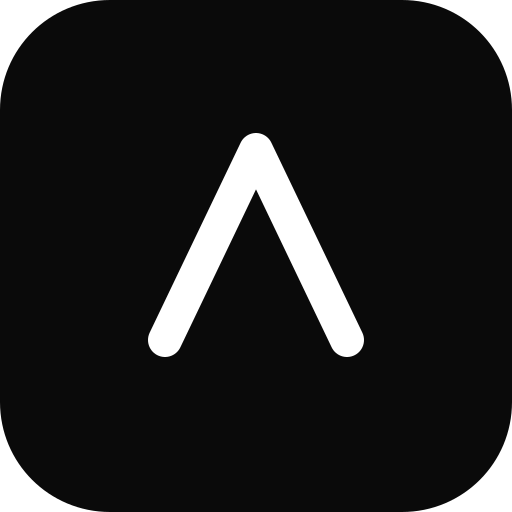
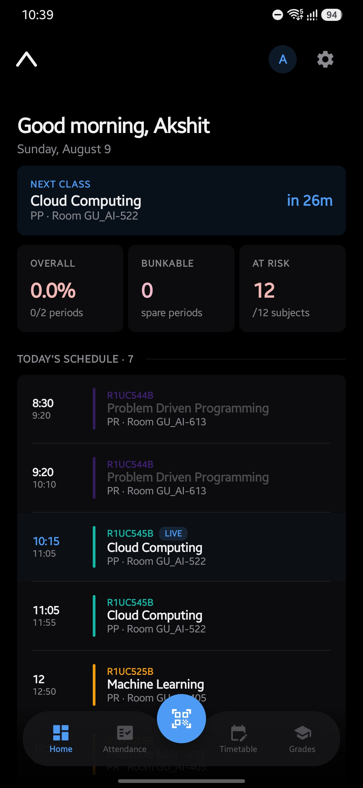
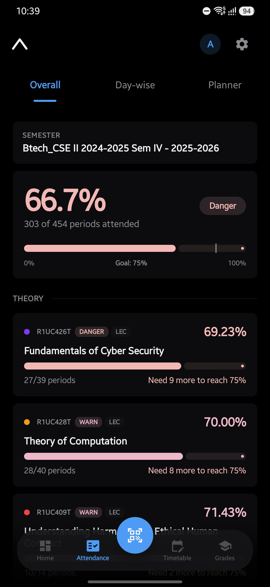
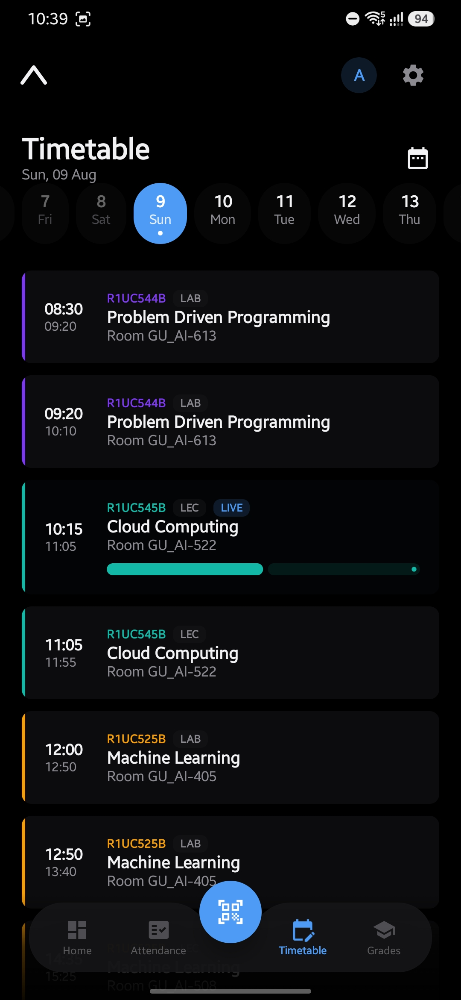
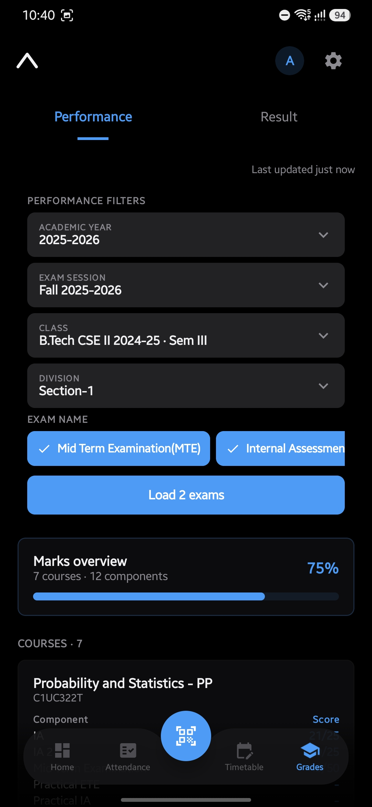
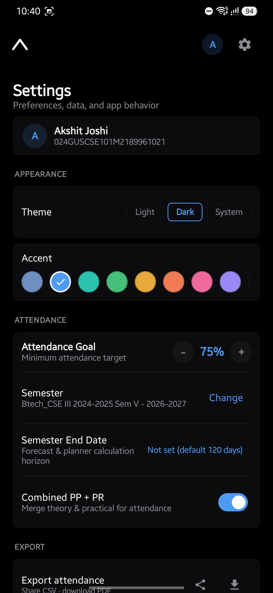
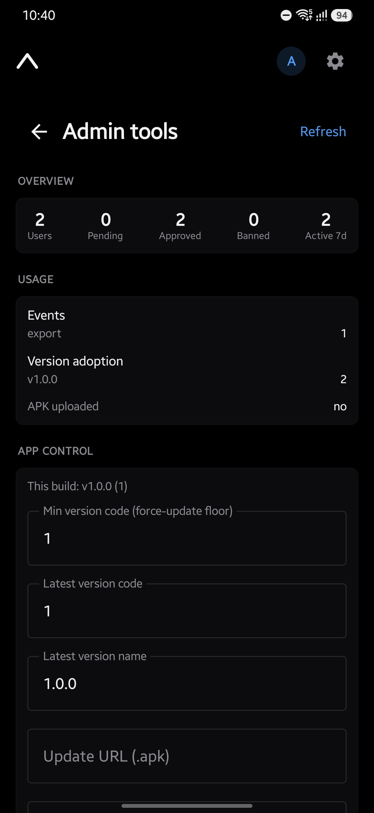

<div align="center">



# Axis

**A fast, modern Android client for Galgotias University students.**

Axis is a rebranded, ground-up rebuild of the student experience on top of the university's iCloudEMS
system — attendance, timetable, grades, and QR attendance in one clean, offline-friendly app.

</div>

---

## Screenshots

| Dashboard | Attendance | Timetable | Grades |
| :---: | :---: | :---: | :---: |
|  |  |  |  |

| Settings | Admin tools |
| :---: | :---: |
|  |  |

---

## Features

- **Dashboard** — today's classes, attendance at a glance, and what's next.
- **Attendance** — per-subject breakdown with **forecasting** ("how many can I skip / must I attend to hit my
  target?") and combined-attendance handling.
- **Timetable & planner** — day-wise schedule with a clean weekly view.
- **Grades** — marks and performance insights per course.
- **QR attendance** — scan the class QR, capture a selfie, and mark attendance (ML Kit + ZXing decode pipeline).
- **Export** — share or save attendance/timetable as **PDF / CSV / ICS** straight to Downloads.
- **Themes** — light/dark plus accent-colour profiles.
- **One-tap auto-update** — the app can download and install a new build in place, no store required.
- **Governed access** — the owner approves, kicks, or bans users, and can force-update or kill-switch every
  client remotely (see [Admin](#admin--governance)).

---

## Architecture

Axis is two pieces: the Android app and a small Cloudflare Worker backend.

```
┌────────────────────────┐     iCloudEMS token      ┌──────────────────────┐
│   Axis Android app     │ ───── (identity) ──────▶ │   iCloudEMS (GU)     │
│  Kotlin · Compose      │                          │  attendance / grades │
│  Hilt · Room · Retrofit│                          └──────────────────────┘
└───────────┬────────────┘
            │  remote config · sessions · usage · admin
            ▼
┌────────────────────────┐   KV (config) · D1 (users, metrics) · R2 (APK)
│   Axis backend         │
│  Cloudflare Worker (TS)│   iCloudEMS = identity provider
└────────────────────────┘   Axis backend = authorization authority
```

- **iCloudEMS** stays the source of identity and academic data.
- **Axis backend** is the *authorization authority*: it decides who may use Axis (pending / approved / banned),
  serves remote config (bearer rotation, force-update, kill-switch, notices), records aggregate usage, and can
  host the release APK. It's **additive** — if the backend is unreachable, the app falls back to compiled-in
  defaults and keeps working.

### Modules

| Path | What it is |
| ---- | ---------- |
| [`app/`](app) | The Android application (UI, view-models, feature screens). |
| [`core/`](core) | Shared foundation — theme, navigation, networking, storage, security. |
| [`backend/`](backend) | The Cloudflare Worker (remote config, governance, usage, APK). See its [README](backend/README.md). |

---

## Tech stack

**App:** Kotlin · Jetpack Compose · Hilt · Room · Retrofit + kotlinx.serialization · DataStore ·
EncryptedSharedPreferences · CameraX · ML Kit + ZXing · Coroutines/Flow. `minSdk 26`, `targetSdk 35`.

**Backend:** TypeScript on Cloudflare Workers · KV · D1 (SQLite) · R2 · `crypto.subtle` (HS256 sessions) ·
Vitest.

---

## Building

Requires JDK 17 and the Android SDK.

```bash
# Debug build (installable, universal ABI — good for emulators)
./gradlew :app:assembleDebug

# Everything the CI gate checks
./gradlew :app:assembleDebug test ktlintCheck detekt

# Release build (R8 + resource shrink, ARM-only, ~12 MB)
./gradlew :app:assembleRelease
```

### Configuration — `local.properties`

```properties
# iCloudEMS bearer baked into the build (optional; the backend can override it live).
API_AUTH_TOKEN=...
# Axis backend base URL. Blank → governance/remote-config/auto-update are disabled and the app runs ungoverned.
REMOTE_CONFIG_URL=https://<your-worker>.workers.dev/

# Release signing (see below). Blank → assembleRelease falls back to the debug key for local testing.
RELEASE_STORE_FILE=/path/to/axis-release.jks
RELEASE_STORE_PASSWORD=...
RELEASE_KEY_ALIAS=axis
RELEASE_KEY_PASSWORD=...
```

### Release signing

```bash
keytool -genkeypair -v -keystore ~/axis-release.jks -alias axis -keyalg RSA -keysize 2048 -validity 10000
```
Fill the `RELEASE_*` properties above with the keystore/key details, then `./gradlew :app:assembleRelease`.

---

## Admin & governance

The same APK ships to everyone; when the **owner** logs in they get an **Admin tools** page (Settings → Admin
tools). From their phone the owner can:

- **Approve / Kick / Ban** users (kick → back to pending; ban → hard block that survives re-login), or
  **Approve all** pending at once, or auto-approve by **admno prefix**.
- **Force a minimum version**, advertise the **latest build**, flip the **kill-switch**, or post a
  **notice banner** — pushed live to every client.
- See **usage**: user counts, active-in-7-days, per-build **version adoption**, and event counters
  (QR scans, exports, …).

Everything is backed by the Worker — see [`backend/README.md`](backend/README.md) for setup, routes, and the
one-tap-update / APK-hosting flow.

---

## Project status

Actively developed. The app is built and running on-device; the backend is deployed on Cloudflare Workers.

## License

Private project — not currently licensed for redistribution.

<div align="center"><sub>Built for Galgotias University students · not affiliated with or endorsed by the university or iCloudEMS.</sub></div>
